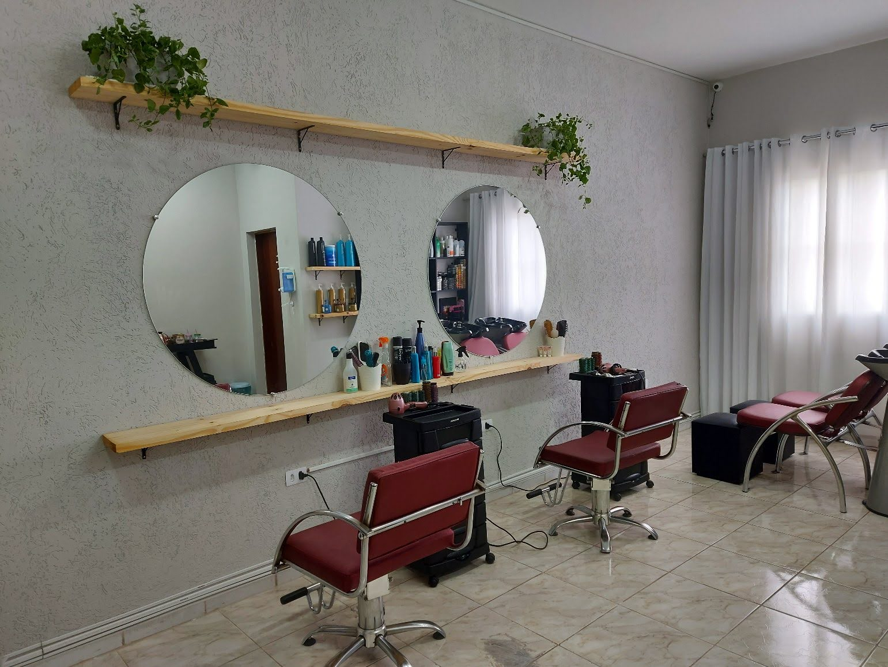

# 💇‍♀️ Studio P Concept

Aplicação web desenvolvida para apresentar os serviços do **Studio P Concept**, um salão de beleza moderno que valoriza a feminilidade e o autocuidado.  
Projeto feito com **React + TypeScript + Vite**, com design responsivo e elegante.  

---

## ✨ Funcionalidades
- 📌 **Home** com destaque da identidade visual  
- 💇‍♀️ **Serviços**: corte, escova, hidratação, reconstrução, mechas, progressiva  
- 🖼️ **Galeria de imagens** com trabalhos realizados  
- 📍 **Quem Somos**: apresentação do salão  
- 📞 **Contato** com endereço, horário de funcionamento e link direto para WhatsApp  
- 📱 **Design Responsivo**: adaptado para desktop e mobile  

---

## 🛠️ Tecnologias
- ⚡ [Vite](https://vitejs.dev/)  
- ⚛️ [React](https://reactjs.org/)  
- 🟦 [TypeScript](https://www.typescriptlang.org/)  
- 🎨 CSS com boas práticas (Flexbox, Grid e variáveis CSS)  

---

## 📂 Estrutura de Pastas
